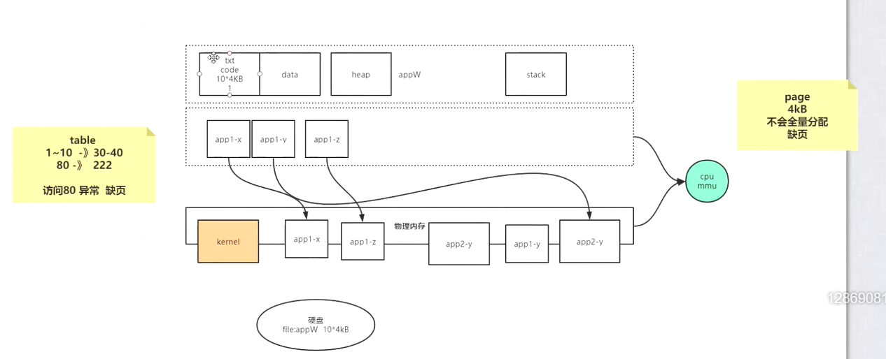

字节跳动：epoll < 怎么知道数据到达 中断

程序文件从硬盘加载到内存，以page(4k)为单位加载，而且不是一次性加载所有代码，根据需要动态地加载，

不常用的page根据LRU算法从内存中淘汰掉。程序分配的内存位于虚拟内存中，当程序执行时会从虚拟内存调入物理内存中执行，虚拟内存到物理内存的映射由cpu的MMU（内存管理单元）负责，如果不存在虚拟内存page到物理内存page的映射，则产生缺页异常，缺页异常会触发中断，程序由用户态切换到内核态，内核负责建立虚拟内存page到物理内存page之间的映射，之后程序由内核态切换到用户态，程序继续执行；

psstat  /bin/bash: 这个命令是询问内核当前这个程序在内存中分配了多少pageChace;